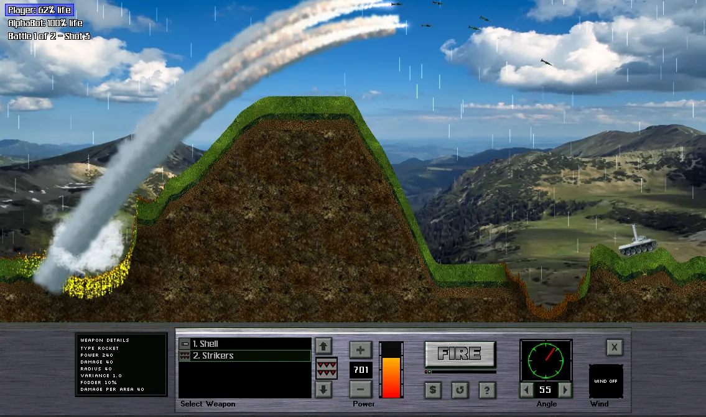

# Atomic Cannon

A turn-based artillery game built in TypeScript with an HTML5 canvas renderer.
Two or more tanks take turns lobbing shells across deformable terrain — adjust
your angle and power, account for the wind, and blow up the other tank.

This project is a from-scratch reinterpretation of **Atomic Cannon**, the
classic artillery game by **Isotope 244** — a tribute to their incredible work
that got so many of us hooked. All credit for the original design goes to them.
None of the original game's assets are included here; this is an independent
reimplementation. If you love this, go find and support the original (even though
you cannot buy it).



## Requirements

- [Node.js](https://nodejs.org/) 18 or newer
- [pnpm](https://pnpm.io/) — the easiest way is Node's built-in Corepack:

  ```bash
  corepack enable
  ```

  This project pins its pnpm version via the `packageManager` field, so Corepack
  uses the right one automatically.

## Running

Install dependencies and start the dev server:

```bash
pnpm install
pnpm dev
```

Then open <http://localhost:2141>.

The dev server hot-reloads on source changes.

## Other commands

| Command | What it does |
|---|---|
| `pnpm dev` | Start the Vite dev server on port 2141 |
| `pnpm build` | Produce a production build in `dist/` |
| `pnpm preview` | Serve the production build locally |
| `pnpm typecheck` | Type-check the project (`tsc --noEmit`) |

## Controls

| Input | Action |
|---|---|
| Angle slider / **←** **→** | Aim the turret |
| Power slider / **↑** **↓** | Adjust firing power |
| **FIRE** button / **Space** | Fire |

## Project layout

```
src/
  core/        game entities — tanks, terrain, projectiles, weapons, effects
    rendering/ sprite loading and drawing
  game/        game controller and turn/battle flow
  math/        vector math
  data/        weapon and particle definitions (JSON)
public/
  assets/      images, sounds, and other game assets (served at /assets)
```

## Assets

Game assets live under `public/assets/` (served at `/assets/…`) and are not
committed to the repository. **No assets from the original Atomic Cannon are
included here.** When assets are absent the game still runs, falling back to
simple vector graphics and a gradient sky.

## Credits

Original game **Atomic Cannon** by **Isotope 244**. This repository is an
independent, non-commercial reinterpretation and is not affiliated with or
endorsed by Isotope 244. Thank you for the game.
